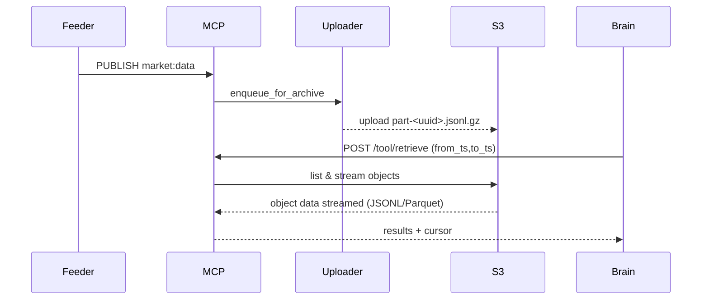

# MCP Server — Project Requirements

**Owner:** kami / 888 Intelligence
**Version:** 1.0
**Last Updated:** 2025-11-18

---

## Purpose & Scope

This document is the single source-of-truth requirements brief for the **MCP Server** (Message & Compute Protocol) used by the Feeder (n8n) and Brain (Claude/Python) agents. It contains design intent, API contracts, storage & archival policies, deployment guidance (Render), testing & CI requirements, security, and operational playbooks so that future Claude Code agents or human engineers can continue development without additional context gaps.

This document consolidates the build plans for the Feeder and Brain agents and the prompt-optimisation guidance provided earlier. See the authoritative build plans and prompt guide referenced below. fileciteturn5file3 fileciteturn5file0 fileciteturn5file4

---

## High-level Vision

Make MCP a production-ready, secure, observable, and resilient ingestion & retrieval bus for agent messaging and light data retrieval used by downstream agents (Brain) and orchestrators (Feeder). MCP should focus on:

* **Correctness & Contract Stability:** Strict schemas for channels and schema_version enforcement. No schema drift without CI tests.
* **Safety:** Emergency kill-switch persistence, replayability, and immediate effect across consumers.
* **Observability:** Structured JSON logs, Prometheus-style metrics, and alert hooks.
* **Durability:** Append-only archival to S3-compatible storage with efficient retrieval (JSONL & Parquet).
* **Developer UX:** Deterministic tests, MinIO-based CI, and clear Render deployment manifests.

---

## Sources of truth

1. Feeder (n8n) build plan (publishing contracts & workflows). fileciteturn5file3
2. Brain (Python/Claude) build plan (consumption contracts & decision flow). fileciteturn5file0
3. Prompt optimisation and engineering rules (how to write system prompts for Claude Code). fileciteturn5file4
4. This repo's existing README, tests, and previous phase patches (refer to commit history).

When in doubt about behavior or missing file names, prefer the conservative, non-breaking implementation and annotate assumptions in code as TODOs.

---

## Actors

* **Feeder (n8n Agent)** — ingests external sources (exchanges, news, social), normalizes and publishes to MCP channels. See Feeder plan. fileciteturn5file3
* **MCP Server** — validates, routes, archives, and provides retrieval & RAG gateway endpoints.
* **Brain (Python/Claude)** — subscribes to MCP, warms via `/tool/retrieve`, performs computation, and publishes signals. See Brain plan. fileciteturn5file0
* **Operators / DevOps** — provision Redis, S3, Render, monitor metrics, and handle incidents.

---

## Channels & JSON Schemas (Immutable unless CI-updated)

MCP must enforce and document the channel schemas exactly. These are the canonical channel contracts:

1. **market:data** (high-frequency price/volume)

```json
{ "timestamp":1678886400, "pair":"BTC-ETH", "price_btc":30000.0, "price_eth":2000.0, "volume_btc":150.5, "schema_version":"v1" }
```

2. **sentiment:data** (RAG/LLM processed sentiment)

```json
{ "timestamp":1678886405, "source":"Twitter", "score":0.85, "summary":"Major institution announces Bitcoin ETF.", "schema_version":"v1" }
```

3. **agent:control** (emergency/system commands)

```json
{ "timestamp":1678886410, "command":"EMERGENCY_HALT", "reason":"USDT_DEPEG_DETECTED", "schema_version":"v1" }
```

4. **agent:signal** (final actionable output from Brain)

```json
{ "timestamp":1678886415, "pair":"BTC-ETH", "action":"SHORT_SPREAD", "confidence":0.78, "stop_loss_z":3.0, "reason":"Z-Score > 2, ML Confirmed", "schema_version":"v1" }
```

**Important:** These channel names and fields are *contractual*—do not change them without updating the test-suite and CI.

---

## API Endpoints (MCP surface)

All endpoints require `x-api-key` unless `MCP_DEV=true`.

### Core endpoints (must exist)

* `POST /tool/publish`

  * Accepts `{ "channel":"market:data", "message": { ... } }`
  * Validates schema for the channel, publishes to Redis, returns publish receipt.
  * Enqueues message for archiver if relevant (market:data, agent:signal).

* `GET /tool/kill_history?limit=<n>`

  * Returns recent EMERGENCY_HALT records. Reads from S3 (if configured) or local append-only logs.

* `GET /tool/get_status`

  * Lightweight health/status: metrics, queue-depth, last-kill timestamp.

* `POST /tool/retrieve` — **Retrieval API** (detailed below)

* `POST /tool/search_rag` — **RAG gateway (placeholder until vector DB configured)**

### Retrieval API contract (`/tool/retrieve`)

Request (JSON):

```json
{
  "collection":"market",
  "pair":"BTC-ETH",
  "from_ts":1678880000,
  "to_ts":1678886400,
  "limit":1000,
  "cursor": null
}
```

Behavior:

* If `S3_DATA_BUCKET` or `S3_KILL_BUCKET` configured:

  * Use **boto3 paginator** to list objects under prefix `mcp/{collection}/`.
  * For each object: if `.parquet` use `pyarrow` streaming; else assume JSONL (possibly gzipped) and stream lines.
  * Stop when `limit` reached. Return `results` and an opaque `cursor` (base64 JSON containing last object key + offset + timestamp).
* Else if `DATA_DIR` configured: read local `collection_*.jsonl` files and stream results.
* Else: return `501 Not Implemented` with guidance.

Safety:

* Enforce `limit` hard cap (e.g., 50,000).
* Cursor must be stateless and safe (base64-encoded JSON); server must validate and reject malformed cursors.

Tests required:

* `S3 disabled => 501`
* `DATA_DIR` local test returning limited rows
* Parquet file read test (local)

---

## Archival & Uploader (background worker)

Purpose: append-only archival of important collections for replay/backtest and kill-history persistence.

Design:

* **Uploader module** (e.g., `uploader/archiver.py`) runs as a background worker with a bounded in-memory queue.
* **Enqueue points:** `POST /tool/publish` calls `enqueue_for_archive(collection, message)` for `market:data` and `agent:signal` (non-blocking).
* **Batching & flush policy:** group by collection + time-bucket (minute), flush after `ARCHIVE_FLUSH_INTERVAL` or when `ARCHIVE_BATCH_SIZE` reached.
* **File formats:** default gzipped JSONL (`.jsonl.gz`) or Parquet (`.parquet`) when configured via `ARCHIVE_FORMAT`.
* **Naming convention:**

  * `s3://{bucket}/mcp/{collection}/year=YYYY/month=MM/day=DD/hour=HH/part-{uuid}.jsonl.gz`
  * or `.parquet`
* **S3 writes:** use boto3 with retries and exponential backoff. For local testing / fallback, write to `ARCHIVE_DIR`.
* **No deletes:** uploader must never delete archive objects.
* **Metrics:** `mcp_archive_queue_size`, `mcp_archive_flush_count`, `mcp_archive_failures`.
* **Graceful shutdown:** flush buffers on SIGTERM.

Operational notes:

* Aim for target file sizes ≥ 1MB to avoid S3 small-object costs. Compress JSONL to reduce PUT frequency.
* Optionally write Parquet in the uploader for analytics-read efficiency (requires `pyarrow` & `pandas`).

Tests required:

* Local flush test writes `.jsonl.gz` to `ARCHIVE_DIR` with correct naming and content.
* MinIO integration test validates object appears in the bucket and path.

---

## RAG / Vector DB Integration (Roadmap)

* Provide `POST /tool/search_rag` endpoint as a safe placeholder that returns `501` until `VECTOR_DB_TYPE` + `VECTOR_DB_URL` are configured.
* Add `tooling/vector_adapter.py` with adapters for Weaviate, Milvus, Pinecone (stubbed). Add TODOs for embedding ingestion (news → embeddings → vector store).
* Document the ingestion pipeline in README and add a scaffolded n8n ingestion workflow.

---

## CI, Local Dev & MinIO

* **docker-compose.ci.yml** must include: core-mcp, redis, minio, and a seeder (script) to upload test JSONL/Parquet files.
* **GitHub Actions** workflow `.github/workflows/ci-s3.yml` should spin up compose, seed MinIO, run `pytest tests/integration`, then tear down.
* Prefer MinIO for CI to emulate S3 semantics accurately.

---

## Metrics, Logging & Observability

* **Metrics:** Provide Prometheus-style metrics via `prometheus_client` / background `start_http_server(METRICS_PORT)`:

  * `mcp_publish_total{channel}` (counter)
  * `mcp_publish_latency_seconds` (histogram)
  * `mcp_validation_failures_total`
  * `mcp_halt_total`
  * `mcp_archive_queue_size`, `mcp_archive_flush_count`

* **Logging:** Structured JSON logs using `python-json-logger` including `request_id` per request.

* **Alerting:** Create alert rules for high validation_failures, halt_count spikes, and archive queue depth exceeding thresholds.

---

## Security & Secrets

* **All secrets** must be provided via environment variables (Render secrets) and never committed.

* **Required env vars (examples):**

  * `MCP_API_KEY` (required)
  * `REDIS_URL`
  * `S3_DATA_BUCKET`, `S3_KILL_BUCKET` (optional)
  * `AWS_ACCESS_KEY_ID`, `AWS_SECRET_ACCESS_KEY`
  * `ARCHIVE_DIR` (local fallback)
  * `VECTOR_DB_TYPE`, `VECTOR_DB_URL` (optional)
  * `PUBLISH_RATE_LIMIT`, `MAX_BODY_BYTES`, `METRICS_PORT`

* **IAM:** restrict S3 IAM to `s3:PutObject/GetObject/ListBucket` on the `mcp/*` prefix only.

* **Network:** use managed Redis with private networking in production.

* **Transport security:** enforce HTTPS; assume Render provides TLS on the endpoint.

---

## Render deployment guidance

* Provide `render.yaml` with a Web Service (Dockerfile-based) and optionally a Background Worker for the uploader/archiver.
* Set health-check path to `/tool/get_status`.
* Required Render secrets: `MCP_API_KEY`, `REDIS_URL`, `AWS_ACCESS_KEY_ID`, `AWS_SECRET_ACCESS_KEY`, `S3_DATA_BUCKET`.
* Note on metrics: Render-managed public services are often not directly scrappable—consider Pushgateway or log-based metrics for production.
* Instance sizing: start with small (512MB) and scale as needed; recommend a separate worker if upload throughput is high.

---

## Testing & Acceptance Criteria

Automated tests must exist for:

* **Unit tests:** schema validation, retrieve JSONL & parquet readers (local), archiver queue logic.
* **Integration tests (CI with MinIO):**

  * `test_s3_retrieve` reads seeded MinIO objects and returns expected rows.
  * `test_uploader_s3` publishes messages and asserts objects appear in MinIO.
  * `test_retrieve_501` when no storage configured.
* **Manual smoke tests:** run docker-compose with `DATA_DIR` or MinIO and exercise `/tool/publish`, `/tool/retrieve`, `kill_history`, and uploader flush.

Acceptance:

* `pytest` integration suite green in CI.
* `POST /tool/retrieve` returns correct results and cursor-based pagination works.
* EMERGENCY_HALT persisted and retrievable via `kill_history` after restarts.

---

## Operational Playbook (quick)

**Emergency Halt (EMERGENCY_HALT) detected:**

1. `GET /tool/kill_history?limit=20` to inspect recent kill events.
2. Check `mcp_halt_total` Prometheus metric and recent logs with `request_id`.
3. If halt persists, investigate uploader archive for audit objects in S3 prefix `mcp/agent:control`.
4. To un-halt: operator-approved workflow publishes `agent:control` with `command: RESUME` (documented as future safe operation).

**Backfill / Replay:**

1. Use archived objects in S3 (by date range) and run the `replay` tool to publish to Redis channels for backtesting.
2. Ensure replay runs against staging Brain instances with safety flags enabled.

---

## Diagrams

Below are textual/mermaid diagrams to help future agents visualise the architecture. These reflect the Feeder and Brain build plans. See the original Build Plans for detailed diagrams. fileciteturn5file3 fileciteturn5file0

```mermaid
flowchart LR
  subgraph External
    A[Exchanges, News, Social] --> Feeder[n8n Feeder]
  end
  Feeder -->|PUBLISH| MCP[MCP Server (FastAPI + Redis)]
  MCP -->|PUB/SUB| Brain[Brain Agent (Python/Claude)]
  Brain -->|PUBLISH| MCP
  MCP -->|ARCHIVE| S3[S3 / MinIO]
  MCP -->|METRICS| Monitor[Prometheus / Pushgateway]
```

Event path for retrieval & replay:



---

## How to onboard a Claude Code agent (system prompt guidance)

* Provide the **full repository link** at the top of the prompt and include the `Build Plan` files as documents (wrap each in `<document>` tags) per the prompt optimisation guide. fileciteturn5file4
* Require output in structured sections (summary, file_tree_changes, patches, tests_to_run, render_manifest, verification_log) so the agent produces git-apply-ready patches.
* Use chain-of-thought-hidden planning: require a hidden decomposition but demand final outputs without internal reasoning.
* Demand anti-hallucination checks: verify new imports are in `requirements.txt`, do not alter channel schemas, and include TODO annotations for assumptions.

---

## Change log / Next work items

* **TODO:** implement Parquet writer in uploader and add `pyarrow` unit tests.
* **TODO:** add vector_adapter integrations (Weaviate/Milvus/Pinecone) and ingestion pipelines from Feeder.
* **TODO:** create `render.yaml` and ensure background worker pattern is supported on Render.
* **TODO:** add Grafana dashboard JSON and alert rules in repo.

---

## References (linked sources of truth)

* Feeder (n8n) build plan — `Build Plan_ n8n 'Feeder' Agent (Agent 1).pdf`. fileciteturn5file3
* Brain (Python) build plan — `Build Plan_ Python 'Brain' Agent (Agent 2).txt`. fileciteturn5file0
* Prompt optimisation guide — `prompt optimisation tips .txt`. fileciteturn5file4

---

*Document generated to help Claude Code agents and engineers continue feature development without additional onboarding. Update this file when adding or changing architectural contracts.*
